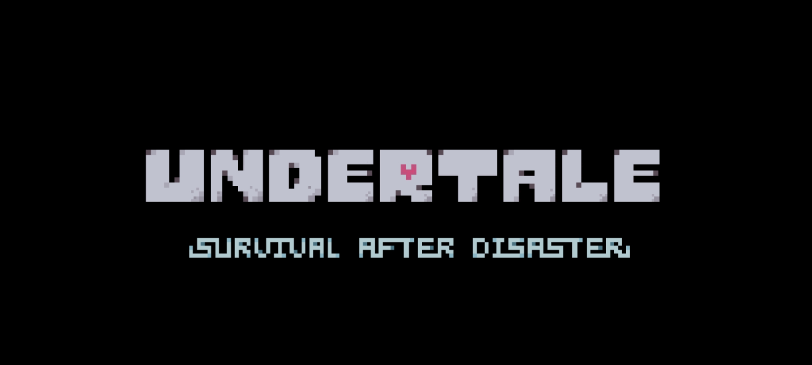

# 🎮 传说之下：劫后余生  
**Undertale: Survival After Disaster**  
_开发版本 v0.01 测试版_

📁 本项目中的素材目录均已包含 `.nomedia` 文件，防止出现在用户图库或播放器中，保护沉浸体验。


---

## 🧭 项目简介

《传说之下：劫后余生》是一款基于 Toby Fox 原作《Undertale》世界观制作的粉丝向剧情游戏。  
游戏继承了原作的独特战斗系统与叙事风格，讲述在一个全新地下世界展开的生还冒险。  

由 **BOOM! Studio（原 灰烬重生工作室）** 制作，项目完全开源，面向所有热爱 Undertale 的玩家与开发者。

---

## 🌟 游戏特色

- 原汁原味的 Undertale 式战斗机制
- 全新角色设定与原创主线剧情
- 像素风美术 + 自制音乐
- 多线道德选择影响故事走向

---

## 🛠️ 运行环境

- **平台**：Android 9.0+
- **运行环境**：Termux + Termux-X11
- **开发语言**：Python 3.8+
- **游戏框架**：Pygame

---

## 📦 安装指南（适配 Termux 原生环境）

请先通过 [F-Droid](https://f-droid.org/) 安装最新版 Termux 与 Termux-X11。

---

### 🧱 第一步：安装系统依赖

```bash
pkg update && pkg upgrade

pkg install python clang make git wget ffmpeg pkg-config freetype libpng libjpeg-turbo

pkg install sdl2 sdl2-image sdl2-mixer sdl2-ttf

pkg install x11-repo
pkg install termux-x11-nightly
````

---

### 🐍 第二步：安装 Python 构建环境

```bash
pip install --upgrade pip setuptools wheel cython
```

---

### 🎮 第三步：安装 Pygame

```bash
pip install pygame
```

如安装失败，可尝试：

```bash
LDFLAGS="-lm -lpython3.12" CFLAGS="-O2" pip install pygame --no-cache-dir
```

---

### 📥 第四步：下载游戏源码

```bash
git clone https://github.com/gaowan-u/Undertale-Life-After.git
cd Undertale-Life-After
```

---

### 🚀 第五步：运行游戏

```bash
termux-x11 &
python main.py
```

---

## 📂 项目结构概览

```plaintext
.
├── README.md           # 项目说明文档
├── LICENSE             # 开源协议
├── main.py             # 游戏主程序
├── audios/             # 音频资源（.ogg）
├── fonts/              # 字体资源（.otf）
├── images/             # 图像资源（.png）
├── videos/             # 开场动画（.mp4）
```

---

## 🎨 资源规范

| 类型 | 格式建议          | 备注         |
| -- | ------------- | ---------- |
| 图像 | PNG 1920×1080 | 建议无透明      |
| 音频 | OGG 44.1kHz   | 体积小质量高     |
| 视频 | MP4 H.264 编码  | 控制在 720p 内 |
| 字体 | OTF / TTF     | 推荐思源黑体     |

> 所有资源请放入对应目录，无需修改主程序结构。

---

## 📈 开发进度说明：v0.01 测试版

该版本为**开发中的预览构建**，用于资源加载测试、流程演示和反馈收集。
剧情、交互、动画与系统功能仍在持续开发中，实际体验不代表最终品质。

我们欢迎你反馈 Bug、提出建议或加入创作，一起完善这个地下故事！

---

## 🔐 隐私政策

**版本号**：v1.0
**更新日期**：2025 年 6 月 8 日
**开发团队**：BOOM! Studio（原 灰烬重生工作室）

《传说之下：劫后余生》为纯粹的粉丝项目，不含任何网络连接与数据采集行为。

* 不收集或上传任何用户数据
* 不联网、不访问服务器
* 不请求相册、联系人、摄像头、麦克风等权限
* 所有资源离线运行、无广告、无商业行为

📧 如有问题可联系：**[gaowange2024@163.com](mailto:gaowange2024@163.com)**

---

## 🔐 Privacy Policy (English)

**Version**: v1.0
**Last Updated**: June 8, 2025
**Developer**: BOOM! Studio (formerly 灰烬重生工作室)

This game does **not** collect or store any user data.
It is fully offline, contains **no ads**, and does not access sensitive permissions.

We are committed to respecting user privacy.

📧 Contact: **[gaowange2024@163.com](mailto:gaowange2024@163.com)**

---

## 🤝 贡献与支持

欢迎任何形式的参与：

* 报错 / 提建议 → Issues
* 优化剧情 / 玩法 → Pull Requests
* 提供音乐、美术、剧本 → BOOM! Studio

---

> 💬 感谢所有喜爱 Undertale 的灵魂们——
> 在这片废墟之后，我们一起重新点燃希望之光。