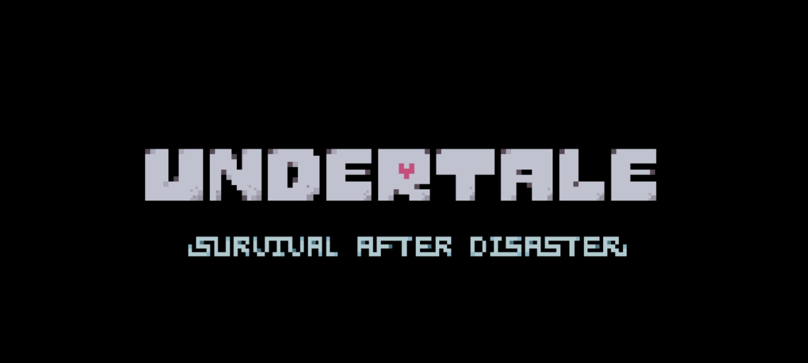

# 🎮 传说之下：劫后余生

**_Undertale: Survival After Disaster_**
_开发版本 v0.0.1-beta_

<details>
<summary>📋 点击查看项目更新日志</summary>

### 项目更新

1. 代码优化：添加 `main_menu.py` 返回类型注解，规范化 `setting.py` 代码格式（2026-02-19）

2. 新增入口场景图片 `images/Entrance.png`（2026-02-19）

3. 重构资源管理系统，新增 `resources.py` 模块，使用单例模式集中管理字体、颜色、路径和遮罩层等共享资源，优化内存使用和加载效率 ，同时更换主菜单背景音乐（2026-02-17）

4. 新增设置菜单 (`setting.py`)，继承主菜单类实现统一的界面风格，支持音量、画质、控制等设置选项框架 （2026-02-17）

5. 新增地图边界检测工具 (`MapBoundaryDetector/`)，使用 OpenCV + C++ 实现自动检测地图可行走区域边界，输出 JSON 格式坐标数据 （2026-02-17）

6. 删除旧的可行走区域顶点数据 (`walkable_area_vertices.json`) 和可视化图片，使用新的地图边界检测方案替代 （2026-02-17）

7. 将 PC 优化分支 (feat/pc-optimization) 合并为主分支，统一开发方向 （2026-02-12）

8. 优化了开场动画的退出逻辑，确保按下ESC键能正确跳过动画 （2025-11-16）

9. 完善了游戏核心功能模块，包括角色移动系统、动画系统和摇杆控制 （2025-10-18）

10. 添加了数据文件支持(positions.json和walkable_area_vertices.json) （2025-10-18）

11. 增加了叙事文本系统，支持多章节剧情结构 （2025-10-07）

12. 新增完整的存档系统，支持多存档位管理和角色名称自定义 （2025-11-30）

13. 添加存档菜单界面，支持创建、加载和删除存档功能 （2025-11-30）

14. 优化音频系统，在音频设备不可用时退出并提供提示 （2025-10-07）

15. 改进主菜单，增加"加载游戏"选项和存档系统整合 （2025-11-30）

16. 改变了一下加载游戏的背景，使其更美观 （2025-10-07）

17. 修复摇杆与按钮交互冲突，完善存档系统 （2026-01-30）

</details>

📁 本项目中的素材目录均已包含 `.nomedia` 文件，防止出现在用户图库或播放器中，保护沉浸体验。


---

## 🧭 项目简介

《传说之下：劫后余生》是一款基于 Toby Fox 原作《Undertale》世界观制作的粉丝向剧情游戏。
游戏继承了原作的独特战斗系统与叙事风格，讲述在一个全新地下世界展开的生还冒险。

由 **BOOM! Studio（原 灰烬重生工作室）** 制作，项目完全开源，面向所有热爱 Undertale 的玩家与开发者。

---

## 🌟 游戏特色

- 原汁原味的 Undertale 式战斗机制
- 全新角色设定与原创主线剧情
- 像素风美术 + 自制音乐
- 多线道德选择影响故事走向

---

## 🛠️ 运行环境

- **平台**：PC (Windows/Linux/macOS) / Android 9.0+
- **运行环境**：PC端直接运行 / Termux + Termux-X11 (移动端)
- **开发语言**：Python 3.8+
- **游戏框架**：Pygame

---

## 📦 安装指南（适配 Termux 原生环境）

请先通过 [F-Droid](https://f-droid.org/) 安装最新版 Termux 与 Termux-X11。

---

### 🧱 第一步：安装系统依赖

```bash
pkg update && pkg upgrade
pkg install python clang make git wget ffmpeg pkg-config freetype libpng libjpeg-turbo
pkg install sdl2 sdl2-image sdl2-mixer sdl2-ttf
pkg install x11-repo
pkg install termux-x11-nightly
```

---

### 🐍 第二步：安装 Python 构建环境

```bash
pip install --upgrade pip setuptools wheel cython
```

---

### 🎮 第三步：安装 Pygame

```bash
pip install pygame
```

---

### 📥 第四步：下载游戏源码

```bash
git clone https://github.com/gaowan-u/Undertale-Life-After.git
cd Undertale-Life-After
```

---

### 🚀 第五步：运行游戏

```bash
termux-x11 -nocursor -br -iglx -noreset -ac > /dev/null 2>&1 &
python main.py
```

---

## 📂 项目结构概览

```plaintext
.
├── README.md           # 项目说明文档
├── LICENSE             # 开源协议 (MIT - 仅非商业用途)
├── main.py             # 游戏主程序入口
├── main_menu.py        # 主菜单界面实现
├── gameplay.py         # 游戏核心玩法逻辑
├── intro_animation.py  # 开场动画播放
├── IFLOW.md            # 项目说明文档
├── .gitignore          # Git忽略规则
├── audios/             # 音频资源（.ogg格式）
├── fonts/              # 字体资源（.ttf格式，NotoSansSC系列）
├── images/             # 图像资源（.png/.jpg格式）
├── videos/             # 视频资源（.mp4格式）
├── data/               # 游戏数据文件（JSON格式）
├── 叙事/               # 剧情文本（Markdown格式）
└── LICENSES/           # 各种许可证文件
```

---

## 🎨 资源规范

| 类型 | 格式建议                  | 备注                     |
| -- | ----------------------- | ---------------------- |
| 图像 | PNG 1920×1080 / JPG     | 建议无透明，所有图片包含.nomedial文件 |
| 音频 | OGG 44.1kHz             | 体积小质量高                |
| 视频 | MP4 H.264 编码          | 控制在 1080p 内          |
| 字体 | TTF/OTF (NotoSansSC系列) | 推荐使用Google Noto Sans SC |

> 所有资源请放入对应目录，无需修改主程序结构。

---

## 📈 开发进度说明：v0.0.1-beta

该版本为**开发中的预览构建**，用于资源加载测试、流程演示和反馈收集。
剧情、交互、动画与系统功能仍在持续开发中，实际体验不代表最终品质。

### 核心功能模块

1. **主程序 (main.py)**
   - 游戏状态管理（开场动画 → 版权声明 → 主菜单 → 游戏玩法）
   - 游戏循环控制
   - 事件处理系统
   - 渲染管理

2. **开场动画 (intro_animation.py)**
   - 顺序播放多张背景图片
   - 配合背景音乐
   - 支持ESC键跳过

3. **主菜单 (main_menu.py)**
   - 使用pygame绘制的菜单界面
   - 包含"开始游戏"、"设置"、"退出"选项
   - 可视化选择器（灵魂之心）
   - 鼠标和键盘交互支持

4. **游戏玩法 (gameplay.py)**
   - 角色移动系统（支持上下左右方向）
   - 触摸摇杆控制（仅移动端）
   - 角色动画系统（站立/行走动画）
   - 资源加载系统
   - 可行走区域定义

### 项目更新说明

我们在此郑重声明：

本项目**仍在持续更新**，但由于核心开发人员的个人事务安排，项目更新速度将明显放缓。我们保证：

- 继续维护现有代码和资源
- 定期审查 Issues 和 Pull Requests
- 确保基础功能稳定可用

我们理解玩家社区的期待，并将尽最大努力在条件允许的情况下推进开发。感谢您一直以来的支持与理解！

---

## 🔐 隐私政策

**版本号**：v1.0
**更新日期**：2025 年 6 月 8 日
**开发团队**：BOOM! Studio（原 灰烬重生工作室）

《传说之下：劫后余生》为纯粹的粉丝项目，不含任何网络连接与数据采集行为。

- 不收集、存储或处理任何用户个人信息（包括但不限于姓名、联系方式、设备信息等）
- 不收集或上传任何用户数据
- 不联网、不访问服务器
- 不请求相册、联系人、摄像头、麦克风等敏感权限
- 本地运行期间不会生成任何可识别用户身份的日志或文件
- 所有资源离线运行、无广告、无商业行为

如未来版本涉及联网或权限变更，将在更新前明确告知用户。

📧 如有问题可联系：**[gaowange2024@163.com](mailto:gaowange2024@163.com)**

---

## 🔐 Privacy Policy (English)

**Version**: v1.0
**Last Updated**: June 8, 2025
**Developer**: BOOM! Studio (formerly 灰烬重生工作室)

This game does **not** collect, store, or process any personal information (including but not limited to name, contact details, device info, etc.).
It does **not** collect or upload any user data.
It does **not** connect to the internet or access any servers.
It does **not** request sensitive permissions such as photos, contacts, camera, or microphone.
No logs or files that can identify users are generated during local gameplay.
All resources run offline, with **no ads** and **no commercial activity**.

If future versions require network access or permission changes, users will be clearly informed before any update.

We are committed to respecting user privacy.

📧 Contact: **[gaowange2024@163.com](mailto:gaowange2024@163.com)**

---

## 📜 许可证授权

| 资源类型   | 许可证协议                          | 证书文件                          |
|------------|-----------------------------------|----------------------------------|
| 程序代码   | [MIT 许可证](LICENSE)              | [查看证书](LICENSE)              |
| 字体资源   | [SIL OFL 字体授权](LICENSES/OFL.txt) | [查看证书](LICENSES/OFL.txt)     |
| 美术素材   | [CC BY-NC 4.0 创作共享](LICENSES/CC-BY-NC-4.0.txt) | [查看证书](LICENSES/CC-BY-NC-4.0.txt) |

> 📌 **授权说明**
>
> - MIT 许可证：允许自由使用、修改和分发代码（禁止商业用途）
> - SIL OFL：保障字体作品的自由使用和衍生开发
> - CC BY-NC 4.0：要求署名且禁止商业使用

---

## 🤝 贡献与支持

欢迎任何形式的参与：

- 报错 / 提建议 → Issues
- 优化剧情 / 玩法 → Pull Requests
- 提供音乐、美术、剧本 → BOOM! Studio

---

## ⚖️ 版权声明

1. **原作版权**
   本游戏《传说之下：劫后余生》中涉及的《Undertale》原作角色、世界观、剧情核心元素等知识产权，均归 **Toby Fox** 及其关联方所有。
   _Undertale™ is a registered trademark of Toby Fox._
   _All original Undertale content copyright © Toby Fox._

2. **衍生内容版权**
   本项目的 **新增剧情、原创角色、独立美术/音频素材、程序代码** 等衍生内容，版权归 **BOOM! Studio** 所有。
   _© 2025 BOOM! Studio. All derivative works licensed under [CC BY-NC 4.0](LICENSES/CC-BY-NC-4.0.txt) (non-commercial)._

3. **粉丝项目性质**
   本项目为非盈利性粉丝创作，与 Toby Fox 官方无任何隶属、授权或合作关系。
   _This is an unofficial fan project, not endorsed by the original copyright holder._

---

> 💬 感谢所有喜爱 Undertale 的灵魂们——
> 在这片废墟之后，我们一起重新点燃希望之光。
